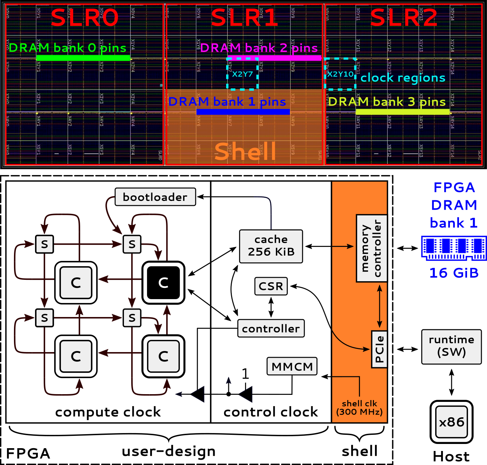
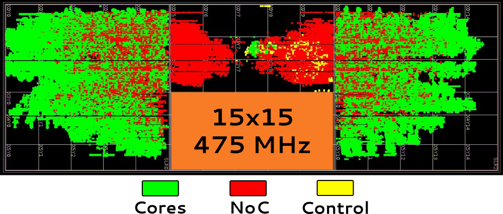
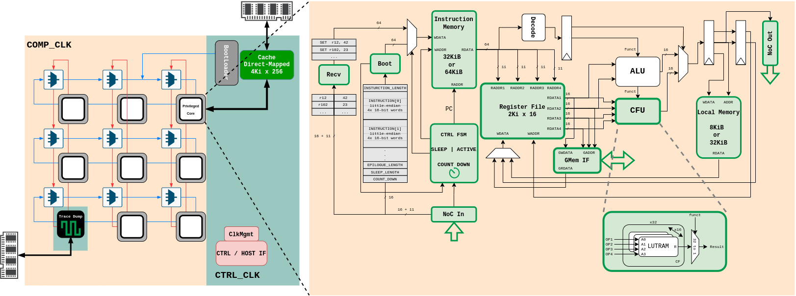
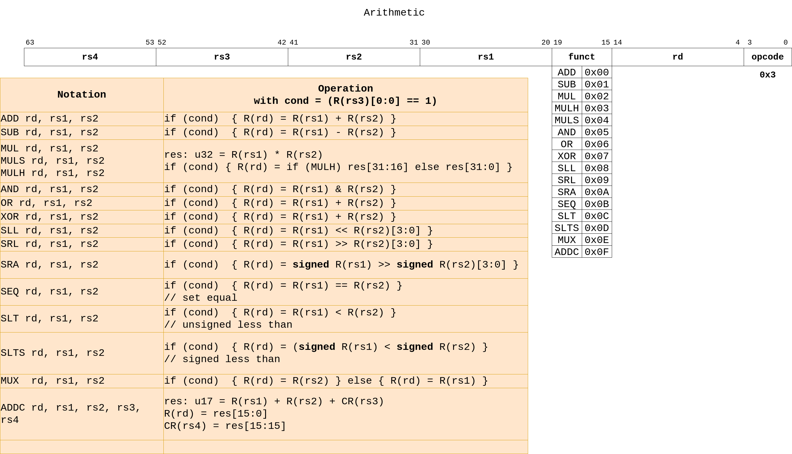
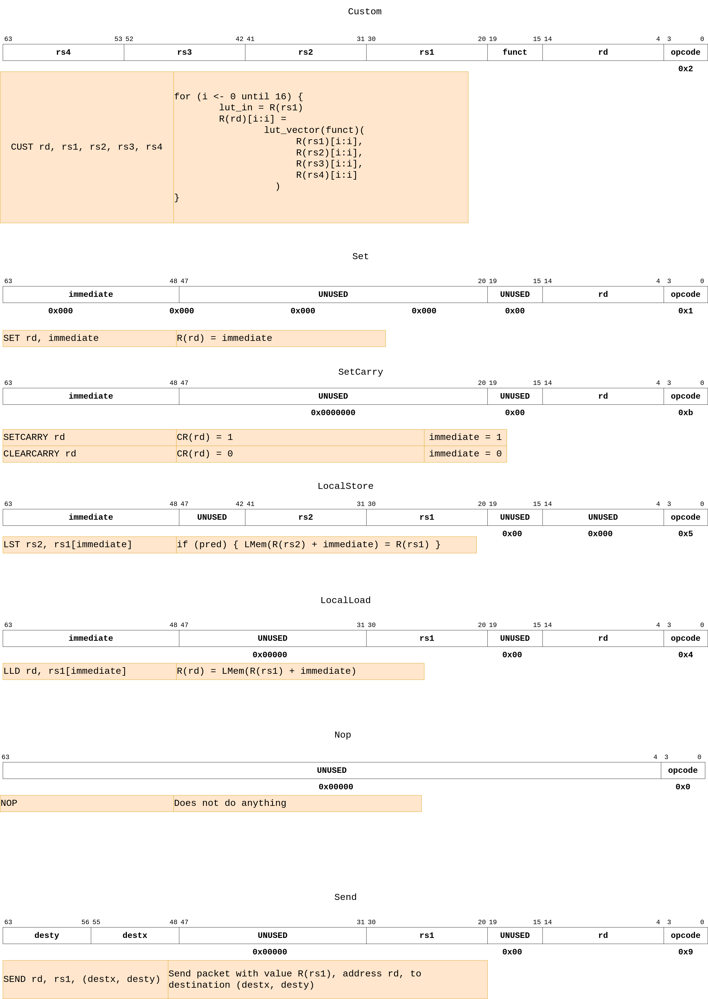
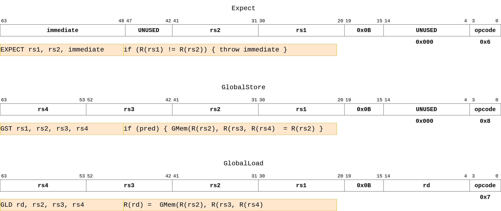

# Manticore

Manticore is an accelerator for parallel RTL simulation.
This repo contains Manticore's HW design files and floorplan generator.
Manticore's design is currently optimized for the AMD Alveo U200 FPGA.
The figure below gives a high-level overview of its design.



The design is parametric and supports a variety of design parameters:
* Grid size (must be square)
* Target clock frequency
* Target Alveo shell platform
* Target floorplan generator
* Number of hops between each NoC switch
* ...

We built Manticore using Vivado 2022.1.
You can run the `build.sh` script from the root of this repository to build your own instance.
You must ensure that `vivado` is included in your `PATH` before launching the script.

The example below builds a 15x15 Manticore design that runs at 475 MHz on the U200.

```bash
# DIMX=$1
# DIMY=$2
# PLATFORM=$3
# FREQ=$4
# EN_CFU=$5
# N_HOP=$6
# PLACEMENT_ALGORITHM=$7
# IMPL_STRATEGIES=$8
# BUILD_DIR=$9
./build.sh                                      \
15                                              \
15                                              \
"xilinx_u200_gen3x16_xdma_2_202110_1"           \
475                                             \
"true"                                          \
1                                               \
"loose-island-loose-cores-center-outward"       \
"Performance_Explore,Performance_NetDelay_high" \
<build_dir>
```

The resulting design will be found in the `<build_dir>` you specify.
The figure below shows what the floorplan of the 15x15 design above looks like after implementation:



Pre-built versions of Manticore designs can be found [here](https://zenodo.org/doi/10.5281/zenodo.10363279).

<!--
You can find an outline of the micro architecture below.


## ISA



 -->
